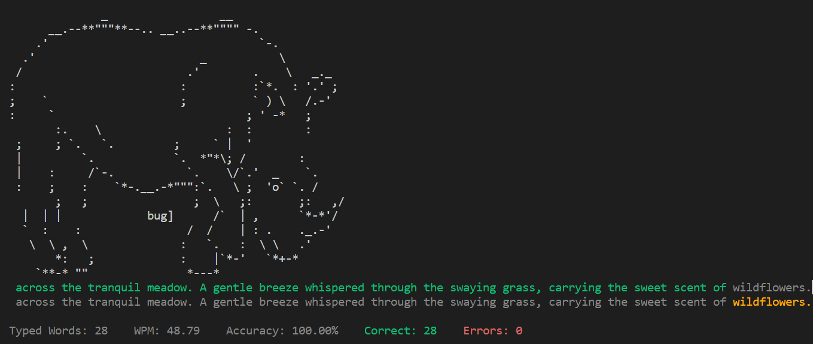

# Learn to Type with Pretty Pictures
Kyeling Ong, Kyle Thompson, Savitha Ravi, Ilana Shapiro

## Proposal
### Project Description
We will create a command-line application that helps users learn to type. 
The application will
1. Give users an easy and fun environment to work on their typing.
2. Provide users with a curriculum of prompts to allow users to gradually develop their typing skills.
3. Gradually reveal mesmerizing images as the user types to make typing fun, mysterious, artistic, and more!

### Project Motivation
We all have a friend whose typing is painful to watch. 
While many typing applications exist to help our typing-challenged friends, few will hold their attention like ours. 
Our project capitalizes on curiosity and goal-oriented behavior to teach typing since as the user types, they unveil a beautiful image. 

### Project Goals
- Support a large number of type-to-complete images so that users do not frequently encounter the same image.
- Define an image-agnostic mechanism for gradually revealing an image to a user.
- Develop and implement a curriculum for helping users to learn to type. Ideas could include:
  - Starting the user with keys on the home row, and gradually introducing new keys as the user proves their proficiency.
  - Defining user proficiency in terms of speed, error-rate, etc. Such metrics could be at the prompt level, or at the individual character level. 
  - Finding coherent (or incoherent) prompts from a restricted set of letters or numbers.
  - Saving user progress so that the same user does not have to start over after the application ends.

### Plan
We will begin by implementing a minimum viable product. The minimum viable product can include the following set of features:
- Choose an image and define a mechanism for gradually revealing it to the user.
- Find prompts from a restricted set of letters or numbers. (Coherency is nice but not required for the MVP)
- Keep track of user typing speed and error rate across the entire prompt to inform whether or not they can progress through the curriculum.
- Combine these features into a single command-line application.

After completing our minimum viable product, we will further develop the application to meet the goals described in the Project Goals section.

### Related Projects
We have conducted research on a variety of exisiting typing-tutor/typing-game projects, including the following:
- [https://www.keybr.com/](https://www.keybr.com/)
- [https://play.typeracer.com/](https://play.typeracer.com/)
- [https://www.coderacer.app/](https://www.coderacer.app/)
- [https://github.com/callum-oakley/gotta-go-fast](https://github.com/callum-oakley/gotta-go-fast)
- [https://github.com/ChrisPenner/void-space](https://github.com/ChrisPenner/void-space)
- [https://github.com/rmehri01/thock](https://github.com/rmehri01/thock)

Our project will differ from these previous works by incorporating the feature of type-to-complete images (images that are displayed piece by piece to reflect the user's completion progress for a given typing prompt).

## Updates 
(as of 12/01/23)

### Application Architecture  
<!-- What is the architecture of your application (the key components)? -->
Our application contains 4 key components:
- _Image interface_: controls how much of the image is revealed as the user types
- _User input tracker_: keeps track of the user's typing progress and errors using a state monad
- _Prompt generator_: creates short passages using Arbitrary class instances and/or Generators
- _Difficulty level calibrator_: integrates the above components by associating user progress with complexity of images and text generated

### Challenges 
<!-- What challenges (if any) did you have so far and how did you solve them? -->
One challenge we faced so far is determining how to translate a user's progress statistic into revealing a portion of the image. We considered several options such as revealing the ASCII image line by line vs. masking parts of the image, whether part of the image is deleted when the user makes an error or whether the user is penalized with additional text, etc.

We decided to adhere to the following definitions:
- user_score = # of correct words - # of errors
- % of image filled in = score / desired score, where desired score = desired # of correct words

### Progress Towards Goals
<!-- Do you expect to meet your goals until the deadline?
If not, how will you modify your goals? -->
We expect to meet our goal of completing a minimum viable product with the 4 components described above. If necessary, we can modify our goals by simplifying some parts of our implementation, for example using finite prompts or revealing images line-by-line. Additional features--such as typing speed, fine-grained error storing, and an advanced version with information about which characters a user tends to make errors on--can be incorporated as time allows.
